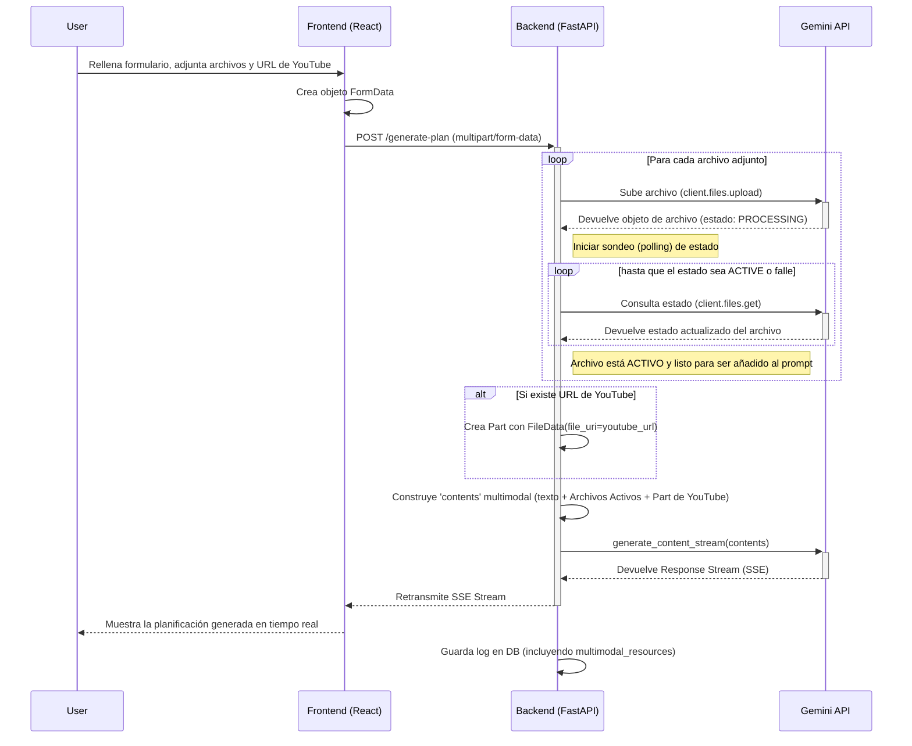

# Diseño Arquitectónico Actualizado: Ingesta Multimodal para la Planificación Docente

**Autor:** Roo, Líder Técnico
**Fecha:** 2025-10-16
**Estado:** Aprobado
**Versión:** 2.0

## 1. Resumen Ejecutivo

Este documento detalla la arquitectura para la evolución del sistema de planificación docente, permitiendo la ingesta y el procesamiento de recursos multimodales (videos de YouTube, imágenes, documentos PDF). Esta actualización alinea el sistema con las mejores prácticas del SDK `google-genai`, asegurando una solución robusta, escalable y preparada para futuras extensiones.

Los cambios clave respecto a la propuesta original incluyen:
1.  **Abstracción sobre el SDK**: El diseño se centra en el modelo de objetos nativo del SDK (`Content`/`Part`) en lugar de detalles de transporte como `multipart/form-data`.
2.  **Manejo Robusto de Archivos**: Se introduce un mecanismo de sondeo (polling) obligatorio para verificar que los archivos estén en estado `ACTIVE` en la File API de Gemini antes de su uso.
3.  **Integración Optimizada de YouTube**: Se utiliza el constructor especializado `types.FileData` para las URLs de YouTube, aprovechando el backend de procesamiento de video de Google.

## 2. Análisis del Estado Actual

-   **Backend**: La API (`api/routers/planning.py`) acepta únicamente `application/json` con datos de texto. El prompt para la IA se construye como una única cadena.
-   **Frontend (Formulario)**: El componente `FormularioPlanificacion.tsx` envía un objeto JSON con campos de texto estándar.
-   **Frontend (Historial)**: El componente `history/[id]/page.tsx` renderiza los parámetros de una planificación pasada desde un campo JSON (`plan_request_data`).

## 3. Plan de Diseño Integrado

### Fase 1: Evolución del Backend (API)

El núcleo de la actualización reside en el backend, que orquestará la subida de archivos, la construcción del prompt multimodal y la comunicación con la API de Gemini.

#### 3.1. Modelos y Base de Datos

-   **`api/db/models.py`**: No se requieren cambios en el esquema. El campo `plan_request_data` (tipo `JSONB`) en la tabla `planning_logs` es suficientemente flexible.
-   **`api/db/planning_crud.py`**: La función `create_planning_log` se adaptará para almacenar una estructura JSON enriquecida que facilite la depuración y la renderización en el frontend.

    ```json
    "plan_request_data": {
        "oa_codigo_oficial": "OA01",
        "recurso_principal": "Texto introductorio...",
        // ... otros campos de texto ...
        "multimodal_resources": {
            "youtube_urls": ["https://www.youtube.com/watch?v=..."],
            "attachments": [
              { 
                "filename": "diagrama.jpg", 
                "gemini_uri": "files/...", 
                "state": "ACTIVE" 
              },
              { 
                "filename": "lectura.pdf", 
                "gemini_uri": "files/...", 
                "state": "ACTIVE" 
              }
            ]
        }
    }
    ```
    *Nota: Almacenar el estado `ACTIVE` final confirma que el recurso se procesó correctamente en el momento de la solicitud.*

#### 3.2. Endpoint `POST /planning/generate-plan`

Este endpoint será el punto de entrada para todas las solicitudes de planificación multimodal.

-   **Firma del Endpoint**: Se modificará para aceptar `multipart/form-data`, el estándar para la subida de archivos a través de formularios web. FastAPI maneja esto de forma nativa.

    ```python
    # Ubicación: api/routers/planning.py
    
    import time
    from fastapi import Form, File, UploadFile, HTTPException
    from typing import List, Annotated
    from google import genai
    from google.genai import types
    
    @router.post("/generate-plan")
    async def generate_plan(
        # Campos existentes como Form en lugar de Body
        oa_codigo_oficial: Annotated[str, Form()],
        recurso_principal: Annotated[str, Form()],
        # ... todos los demás campos de texto ...
    
        # Nuevos campos multimodales opcionales
        youtube_url: Annotated[str, Form()] = None,
        attachments: Annotated[List[UploadFile], File()] = None,
        # ... dependencias ...
    ):
        # Lógica de procesamiento...
    ```

-   **Lógica de Procesamiento Detallada**:
    1.  **Inicialización del Prompt (`contents`)**: Se creará una lista `contents` en Python. El primer elemento será siempre el prompt de texto principal, construido a partir de `recurso_principal` y otros campos de texto.
        ```python
        prompt_text = f"Genera un plan de clase para el OA {oa_codigo_oficial}. Recurso principal: {recurso_principal}..."
        contents = [prompt_text]
        ```
    2.  **Procesamiento de Archivos Adjuntos (`attachments`)**:
        -   Se iterará sobre la lista de `attachments`. Para cada `UploadFile`:
        -   **Subida a la File API**: Se subirá el archivo usando `client.files.upload(file=upload_file.file, display_name=upload_file.filename)`. Es importante pasar el `file-like object` (`.file`) y un nombre para mostrar.
        -   **Sondeo de Estado (Polling)**: **Este es un paso crítico para la robustez**. Tras la subida, el archivo entra en estado `PROCESSING`. Se debe implementar un bucle que consulte periódicamente el estado del archivo hasta que sea `ACTIVE` o falle.
            ```python
            uploaded_file = client.files.upload(...)
            while uploaded_file.state.name == "PROCESSING":
                print(f"Archivo {uploaded_file.name} en procesamiento, esperando 10 segundos...")
                time.sleep(10)
                uploaded_file = client.files.get(name=uploaded_file.name)
            
            if uploaded_file.state.name != "ACTIVE":
                raise HTTPException(status_code=500, detail=f"No se pudo procesar el archivo: {uploaded_file.name}")
            
            # Una vez activo, añadirlo a los contenidos
            contents.append(uploaded_file)
            ```
        -   Se almacenará el `filename`, `gemini_uri` y el estado final (`ACTIVE`) para el log de la base de datos.
    3.  **Procesamiento de URL de YouTube**:
        -   Si se proporciona una `youtube_url`, se debe encapsular en la estructura `types.FileData` para que la API de Gemini utilice su pipeline de video optimizado.
            ```python
            if youtube_url:
                youtube_part = types.Part(
                    file_data=types.FileData(file_uri=youtube_url)
                )
                contents.append(youtube_part)
            ```
    4.  **Llamada al Modelo**: La lista `contents` final, que contiene una mezcla de texto, objetos de archivo activos y partes de YouTube, se pasará al método `generate_content` del modelo.
    5.  **Registro en Base de Datos**: Se construirá y guardará el objeto `plan_request_data` con la estructura detallada en la sección 3.1.
    6.  **Limpieza (Opcional pero Recomendado)**: Considerar la eliminación de los archivos de la File API (`client.files.delete()`) después de un tiempo prudencial para no exceder la cuota de almacenamiento. Dado que los archivos se borran automáticamente a las 48h, esto puede ser una optimización futura.

### Fase 2: Adaptación del Frontend

#### 2.1. Componente `FormularioPlanificacion.tsx`

-   **UI**:
    -   Se añadirá un `TextField` para la "URL de YouTube".
    -   Se implementará un componente de subida de archivos con `<input type="file" multiple />`, restringido a los tipos MIME soportados (ej. `accept=".jpg,.jpeg,.png,.pdf"`).
    -   Se mostrará una lista visual de los archivos seleccionados (ej. `Chip` de MUI con un botón de borrado) para mejorar la experiencia de usuario.
-   **Estado**: Se utilizará el estado de React (`useState`) para gestionar la `youtubeUrl: string` y la lista de `selectedFiles: File[]`.
-   **Lógica de Envío (`onSubmit`)**:
    -   En lugar de crear un objeto JSON, se instanciará un `FormData`.
    -   Se añadirán todos los campos de texto (`formData.append('oa_codigo_oficial', state.oa_codigo_oficial)`).
    -   Se añadirá la URL de YouTube si existe (`formData.append('youtube_url', youtubeUrl)`).
    -   Se iterará sobre `selectedFiles` y se añadirá cada archivo (`formData.append('attachments', file)`).
    -   La llamada a la API (`generatePlanStream` en `lib/api.ts`) se modificará para enviar este `FormData`. Crucialmente, **no se debe** establecer la cabecera `Content-Type`; el navegador lo hará automáticamente a `multipart/form-data` con el `boundary` correcto.

#### 2.2. Componente `history/[id]/page.tsx`

-   **Lógica de Renderizado**:
    -   El componente accederá a `detail.plan_request_data.multimodal_resources`.
    -   Si existe, se renderizará una sección "Recursos Multimodales Utilizados".
    -   Se mapearán las `youtube_urls` para mostrar enlaces `<Link>` al video original.
    -   Se mapearán los `attachments` para mostrar los `filename`. Estos no serán enlaces, ya que los URIs de Gemini son internos y temporales. Servirán como un recordatorio para el usuario de qué archivos utilizó.

## 4. Diagrama de Flujo Actualizado

Este diagrama visualiza el flujo de datos completo, incluyendo los pasos críticos de sondeo.



## 5. Próximos Pasos

1.  **Aprobar el Diseño**: Confirmar que esta arquitectura actualizada es la base para el desarrollo.
2.  **Implementación Backend**: Iniciar el desarrollo de las modificaciones en `api/routers/planning.py` y `api/db/planning_crud.py`.
3.  **Implementación Frontend**: Desarrollar los cambios en `FormularioPlanificacion.tsx` y `history/[id]/page.tsx`.
4.  **Pruebas de Integración**: Realizar pruebas end-to-end con archivos de diferentes tamaños y tipos, así como URLs de YouTube, para validar la robustez del flujo completo.