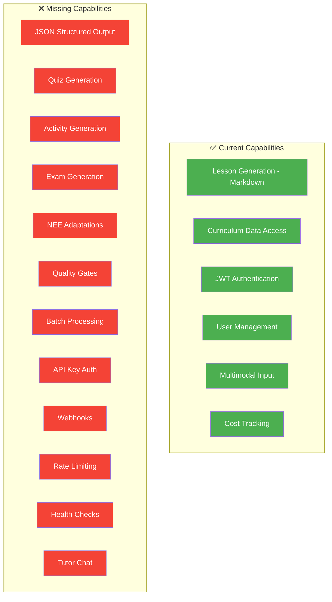
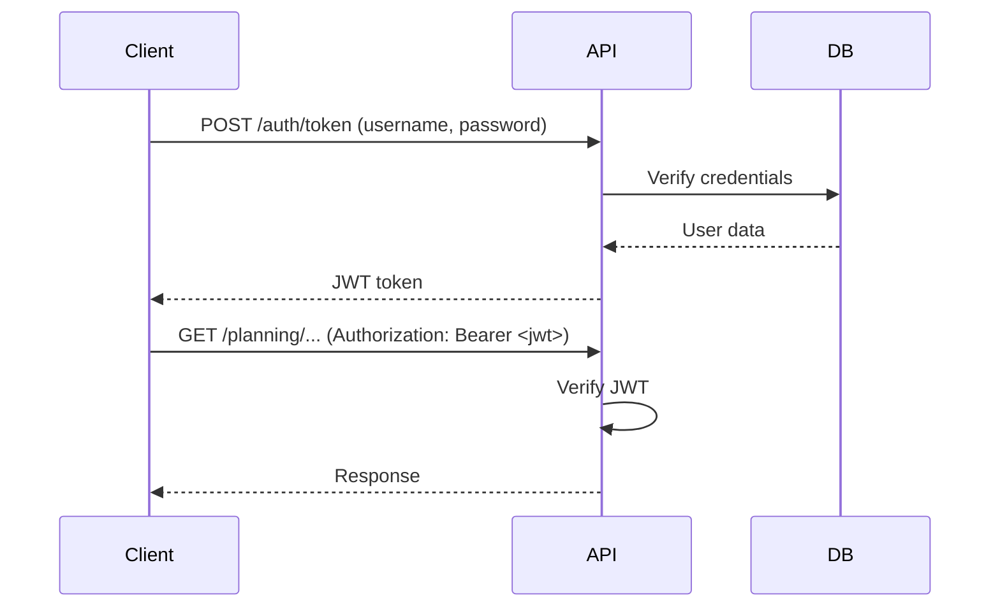
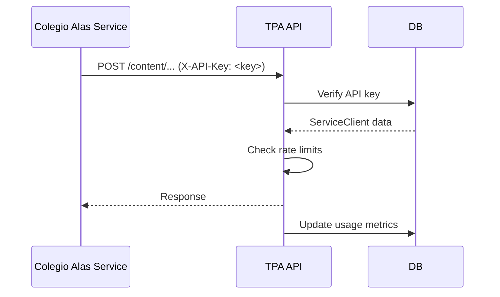
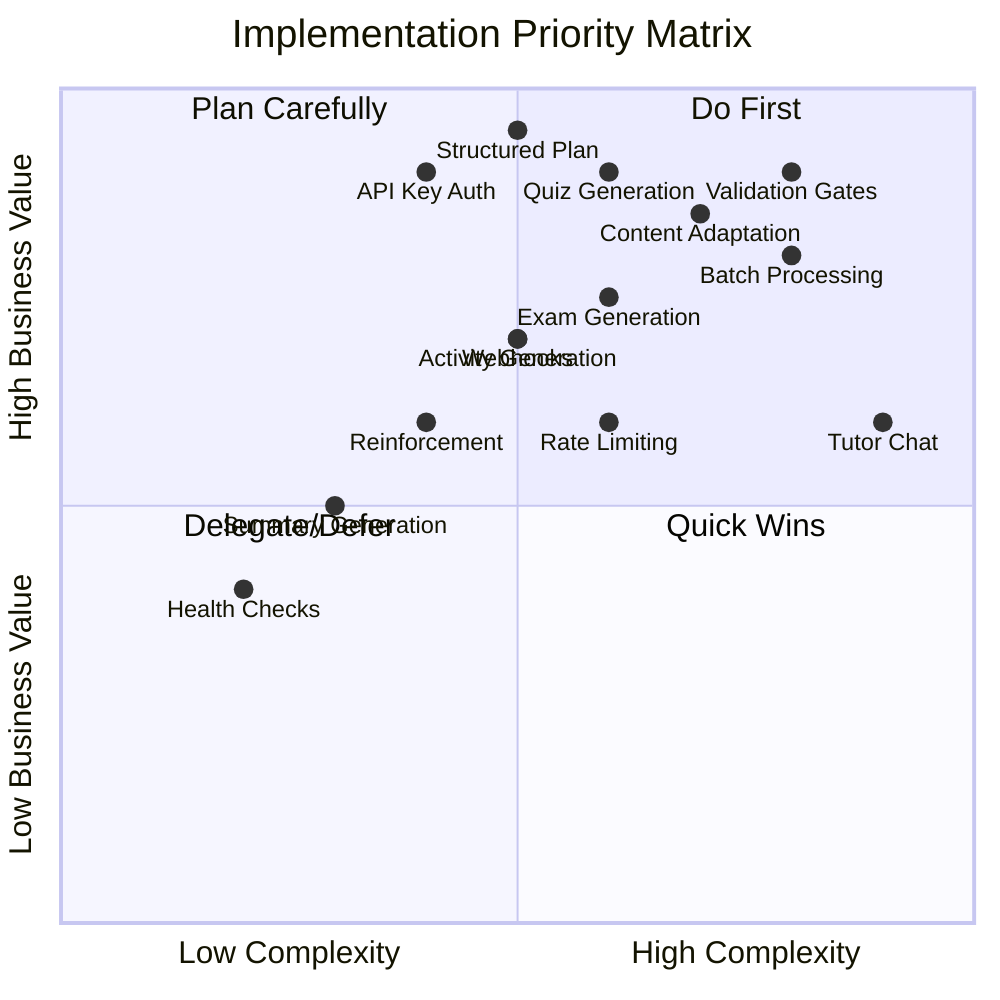
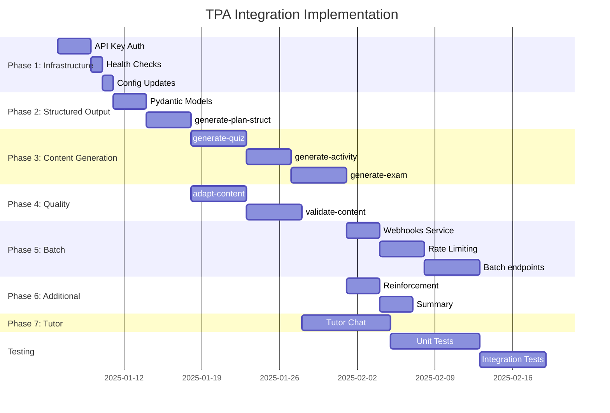

# TPA Integration Analysis for Colegio Alas Inclusivas

> **Version:** 1.0.0  
> **Date:** December 9, 2025  
> **Status:** Analysis Complete  
> **Author:** Architecture Team

---

## Table of Contents

1. [Executive Summary](#1-executive-summary)
2. [Current State Analysis](#2-current-state-analysis)
3. [Integration Requirements Summary](#3-integration-requirements-summary)
4. [Gap Analysis](#4-gap-analysis)
5. [New Endpoint Specifications](#5-new-endpoint-specifications)
6. [Authentication Changes](#6-authentication-changes)
7. [Infrastructure Requirements](#7-infrastructure-requirements)
8. [Pydantic Schema Definitions](#8-pydantic-schema-definitions)
9. [Implementation Priority](#9-implementation-priority)
10. [Estimated Implementation Plan](#10-estimated-implementation-plan)

---

## 1. Executive Summary

### 1.1 Overview

This document analyzes the Teaching Planning Assistant (TPA) codebase to identify the changes required for integration with the Colegio Alas Inclusivas platform. The integration will transform TPA from a teacher-facing tool into an autonomous content generation engine.

### 1.2 Key Findings

| Aspect | Current State | Required State |
|--------|---------------|----------------|
| **Output Format** | Markdown streaming | JSON structured + Markdown |
| **Content Types** | Lessons only | Lessons, Quizzes, Activities, Exams, Summaries, Reinforcement |
| **Authentication** | JWT only | JWT + API Keys (service-to-service) |
| **NEE Support** | Context in prompt | Dedicated adaptation endpoints |
| **Quality Control** | None | Quality Gates with automated validation |
| **Batch Processing** | None | Async batch generation with webhooks |
| **Monitoring** | Basic logging | Health checks, rate limiting, metrics |

### 1.3 Scope of Changes

- **10 new endpoints** to implement
- **2 new routers** (`content`, `tutor`, `validation`, `batch`, `health`)
- **1 new authentication mechanism** (API Keys)
- **30+ new Pydantic models**
- **2 new database tables**
- **2 new services** (Webhook, Rate Limiting)
- **Estimated effort**: ~154 hours

---

## 2. Current State Analysis

### 2.1 Architecture Overview

```
teaching-planning-assistant/
├── api/
│   ├── main.py                 # FastAPI app, CORS, lifespan
│   ├── models.py               # Pydantic schemas
│   ├── requirements.txt        # Dependencies
│   ├── core/
│   │   ├── config.py           # Settings (env vars)
│   │   ├── security.py         # JWT, password hashing
│   │   └── pricing.py          # Cost calculation
│   ├── db/
│   │   ├── session.py          # SQLAlchemy setup (SQLite)
│   │   ├── models.py           # ORM models
│   │   ├── user_crud.py        # User operations
│   │   └── planning_crud.py    # Planning log operations
│   ├── routers/
│   │   ├── auth.py             # Authentication endpoints
│   │   ├── admin.py            # Admin dashboard
│   │   ├── curriculum.py       # Curriculum data
│   │   ├── planning.py         # Plan generation
│   │   └── export.py           # PDF export
│   └── services/
│       ├── curriculum_service.py  # Curriculum data access
│       └── user_service.py        # User business logic
└── data/
    └── processed/
        └── structured_data_enriched.json  # Curriculum data
```

### 2.2 Current Endpoints

| Method | Endpoint | Description | Auth |
|--------|----------|-------------|------|
| `POST` | `/planning/generate-plan` | Generate plan (SSE Markdown) | JWT |
| `GET` | `/planning/history/me` | User's planning history | JWT |
| `GET` | `/planning/history/{id}` | Specific planning detail | JWT |
| `GET` | `/curriculum/niveles` | Course/subject structure | JWT |
| `GET` | `/curriculum/oas` | OAs by course/subject | JWT |
| `POST` | `/auth/token` | Login (get JWT) | None |
| `POST` | `/auth/users/` | Register user | None |
| `GET` | `/auth/users/me` | Current user info | JWT |
| `PUT` | `/auth/users/{username}/status` | Update user status | Admin |
| `PUT` | `/auth/users/{username}/role` | Update user role | Admin |
| `GET` | `/admin/dashboard-stats` | Admin statistics | Admin |
| `GET` | `/` | Root/health | None |

### 2.3 Current Capabilities

#### ✅ What TPA Can Do Now

1. **AI Generation with Gemini 2.5 Pro**
   - Uses `google-genai` SDK
   - Supports thinking mode (`thinking_budget=-1`)
   - SSE streaming responses
   - Cost tracking per generation

2. **Multimodal Input Support**
   - YouTube URL processing
   - File uploads (PDF, images)
   - Gemini Files API integration

3. **Curriculum Data**
   - Complete Chilean National Curriculum (1°-12°)
   - Enriched OA data with skills and components
   - Subject-course-axis-OA hierarchy

4. **User Management**
   - JWT-based authentication
   - User roles (user, admin)
   - Account activation flow
   - Planning history per user

5. **Admin Features**
   - Cost tracking per user
   - Total system statistics
   - User management

### 2.4 Current Models (from [`api/models.py`](api/models.py:1))

```python
# Curriculum Models
class Attitude(BaseModel): ...
class OA(BaseModel): ...
class Eje(BaseModel): ...
class AsignaturaCurso(BaseModel): ...

# Request/Response Models
class PlanRequest(BaseModel): ...
class PlanResponse(BaseModel): ...
class StreamThought(BaseModel): ...
class StreamAnswer(BaseModel): ...

# Auth Models
class Token(BaseModel): ...
class User(BaseModel): ...
class UserCreate(BaseModel): ...

# Admin Models
class AdminDashboardStats(BaseModel): ...
class PlanningLogResponse(BaseModel): ...
```

### 2.5 Current Database Schema (from [`api/db/models.py`](api/db/models.py:1))

```python
class User(Base):
    __tablename__ = "users"
    id: int
    username: str
    email: str
    full_name: str
    hashed_password: str
    is_active: bool
    role: str
    planning_logs: relationship

class PlanningLog(Base):
    __tablename__ = "planning_logs"
    id: int
    user_id: int (FK)
    oa_codigo: str
    cost: float
    input_tokens: int
    output_tokens: int
    thought_tokens: int
    timestamp: datetime
    plan_request_data: JSON
    plan_markdown: Text
```

### 2.6 Current Dependencies (from [`api/requirements.txt`](api/requirements.txt:1))

```
fastapi
uvicorn[standard]
google-genai
python-dotenv
pydantic-settings
passlib[bcrypt]
python-jose[cryptography]
bcrypt==3.2.0
python-multipart
sqlalchemy
alembic
pytz
pypandoc
pypandoc-binary
weasyprint
```

---

## 3. Integration Requirements Summary

### 3.1 New Endpoints Required

From the integration document (Appendix C), the following endpoints are required:

| Priority | Endpoint | Purpose |
|----------|----------|---------|
| **CRITICAL** | `POST /planning/generate-plan-structured` | JSON structured lesson output |
| **CRITICAL** | `POST /content/generate-quiz` | Quiz/assessment generation |
| **CRITICAL** | `POST /content/adapt-content` | NEE content adaptation |
| **CRITICAL** | `POST /validation/validate-content` | Quality gates validation |
| **HIGH** | `POST /content/generate-activity` | Interactive activities |
| **HIGH** | `POST /content/generate-exam` | Summative exam generation |
| **HIGH** | `POST /content/generate-reinforcement` | Remedial content |
| **HIGH** | `POST /batch/generate` | Batch content generation |
| **HIGH** | `GET /batch/status/{batch_id}` | Batch job status |
| **HIGH** | `GET /health/` | Basic health check |
| **HIGH** | `GET /health/ready` | Readiness probe |
| **MEDIUM** | `POST /content/generate-summary` | Unit summaries |
| **MEDIUM** | `POST /tutor/chat` | Conversational AI tutor |

### 3.2 Authentication Requirements

1. **API Key Authentication** (for service-to-service communication)
   - Header: `X-API-Key`
   - Per-client rate limits
   - Usage tracking

2. **JWT Authentication** (existing, for user-facing operations)
   - No changes required

### 3.3 Infrastructure Requirements

1. **Webhooks** - Callback notifications when batch jobs complete
2. **Rate Limiting** - Per-endpoint and per-API-key limits
3. **Health Checks** - For Kubernetes/Docker orchestration
4. **Redis** (optional) - For rate limiting state

---

## 4. Gap Analysis

### 4.1 Feature Gaps



### 4.2 Detailed Gap Analysis

| Area | Current | Required | Gap Type | Priority |
|------|---------|----------|----------|----------|
| **Output Format** | Markdown only | JSON structured | NEW FEATURE | Critical |
| **Lesson Generation** | SSE streaming | + Non-streaming JSON option | EXTEND | Critical |
| **Quiz Generation** | None | Full quiz with questions | NEW FEATURE | Critical |
| **Activity Generation** | None | Interactive activities | NEW FEATURE | High |
| **Exam Generation** | None | Multi-OA exams | NEW FEATURE | High |
| **NEE Adaptation** | Context in prompt | Dedicated endpoint | NEW FEATURE | Critical |
| **Summary Generation** | None | Unit summaries | NEW FEATURE | Medium |
| **Reinforcement** | None | Alternative explanations | NEW FEATURE | High |
| **Tutor Chat** | None | Conversational AI | NEW FEATURE | Medium |
| **Quality Validation** | None | Multi-gate validation | NEW FEATURE | Critical |
| **Batch Processing** | None | Async with callbacks | NEW FEATURE | High |
| **API Key Auth** | None | Service-to-service | NEW FEATURE | Critical |
| **Webhooks** | None | Callback service | NEW FEATURE | High |
| **Rate Limiting** | None | Per-endpoint limits | NEW FEATURE | High |
| **Health Checks** | Basic root only | Full health/ready | EXTEND | High |

### 4.3 Code Impact Analysis

| File | Current Lines | Estimated Changes | Impact |
|------|---------------|-------------------|--------|
| `api/main.py` | 81 | +30 (new routers) | Medium |
| `api/models.py` | 158 | +600 (new schemas) | High |
| `api/core/config.py` | 27 | +20 (new settings) | Low |
| `api/core/security.py` | 45 | +80 (API key auth) | Medium |
| `api/routers/planning.py` | 304 | +150 (structured endpoint) | Medium |
| `api/routers/content.py` | NEW | ~500 | High |
| `api/routers/tutor.py` | NEW | ~200 | Medium |
| `api/routers/validation.py` | NEW | ~200 | Medium |
| `api/routers/batch.py` | NEW | ~300 | High |
| `api/routers/health.py` | NEW | ~100 | Low |
| `api/services/webhook_service.py` | NEW | ~150 | Medium |
| `api/middleware/rate_limit.py` | NEW | ~100 | Medium |
| `api/db/models.py` | 38 | +50 | Medium |

---

## 5. New Endpoint Specifications

### 5.1 Structured Plan Generation

**Endpoint:** `POST /planning/generate-plan-structured`

**Purpose:** Generate lesson plans in JSON structured format for programmatic integration.

**Request Schema:**
```python
class StructuredPlanRequest(BaseModel):
    oa_codigo_oficial: str
    curso: str
    asignatura: str
    duracion_clase_minutos: int = 90
    numero_estudiantes: Optional[int] = None
    diversidad_aula: Optional[str] = None
    dua_compliance: bool = True
    output_format: Literal['json', 'markdown'] = 'json'
    include_adaptations: bool = True
    generate_materials: bool = True
    student_profiles: Optional[List[StudentAccessibilityProfile]] = None
    previous_lessons: Optional[List[str]] = None
    upcoming_assessment: Optional[str] = None
```

**Response Schema:**
```python
class StructuredPlanResponse(BaseModel):
    success: bool
    plan: StructuredLesson
    metadata: GenerationMetadata
    quality_indicators: QualityIndicators
```

**Business Logic:**
1. Validate OA exists in curriculum
2. Build enhanced prompt with structured output instructions
3. Call Gemini with JSON schema enforcement
4. Parse and validate response against schema
5. Calculate quality indicators
6. Log usage and return

---

### 5.2 Quiz Generation

**Endpoint:** `POST /content/generate-quiz`

**Purpose:** Generate formative, diagnostic, or summative quizzes for an OA.

**Request Schema:**
```python
class QuizRequest(BaseModel):
    oa_codigo_oficial: str
    curso: str
    quiz_type: Literal['formative', 'diagnostic', 'summative'] = 'formative'
    num_questions: int = Field(ge=3, le=20, default=10)
    difficulty_distribution: Optional[DifficultyDistribution] = None
    question_types: Optional[List[QuestionType]] = None
    time_limit_minutes: Optional[int] = None
    previous_content: Optional[str] = None
    focus_areas: Optional[List[str]] = None
    include_nee_versions: bool = True
    nee_types: Optional[List[NEEType]] = None
```

**Response Schema:**
```python
class QuizResponse(BaseModel):
    success: bool
    quiz: Quiz
    metadata: GenerationMetadata
```

---

### 5.3 Content Adaptation

**Endpoint:** `POST /content/adapt-content`

**Purpose:** Adapt existing content for specific NEE profiles.

**Supported NEE Types:**
- TEA (Autism Spectrum Disorder)
- TDAH (ADHD)
- Dislexia (Dyslexia)
- Discalculia (Dyscalculia)
- Discapacidad Visual (Visual Impairment)
- Discapacidad Auditiva (Hearing Impairment)
- Discapacidad Motora (Motor Disability)
- Discapacidad Intelectual (Intellectual Disability)
- Trastorno del Lenguaje (Language Disorder)
- Altas Capacidades (Gifted)

**Request Schema:**
```python
class AdaptationRequest(BaseModel):
    content_type: Literal['lesson', 'quiz', 'activity', 'text']
    original_content: str  # Markdown or JSON
    nee_type: NEEType
    student_profile: Optional[StudentProfile] = None
    adaptation_level: Literal['minimal', 'moderate', 'significant'] = 'moderate'
```

**Response Schema:**
```python
class AdaptationResponse(BaseModel):
    success: bool
    adapted_content: str
    adaptations_made: List[AdaptationDetail]
    recommendations: List[str]
    metadata: GenerationMetadata
```

---

### 5.4 Activity Generation

**Endpoint:** `POST /content/generate-activity`

**Activity Types:**
- `practice` - Individual practice
- `game` - Educational game
- `project` - Project-based
- `investigation` - Research activity
- `creative` - Artistic creation
- `debate` - Discussion/debate
- `simulation` - Role-play/simulation
- `lab` - Laboratory/experiment

---

### 5.5 Exam Generation

**Endpoint:** `POST /content/generate-exam`

**Purpose:** Generate summative exams covering multiple OAs.

**Features:**
- Multiple OA coverage
- Section-based structure
- Answer key generation
- Rubric generation
- NEE versions auto-generation

---

### 5.6 Reinforcement Content

**Endpoint:** `POST /content/generate-reinforcement`

**Purpose:** Generate alternative explanations for struggling students.

**Reinforcement Types:**
- `alternative_explanation` - Different approach to explaining
- `additional_examples` - More examples
- `visual_approach` - Visual-focused explanation
- `step_by_step` - Detailed step-by-step
- `analogies` - Using analogies
- `practice_problems` - Additional practice

---

### 5.7 Unit Summary

**Endpoint:** `POST /content/generate-summary`

**Purpose:** Generate comprehensive unit summaries.

**Includes:**
- Key concepts
- Vocabulary
- Concept maps (Mermaid)
- Key formulas (for math/science)
- Study guides

---

### 5.8 Tutor Chat

**Endpoint:** `POST /tutor/chat`

**Modes:**
- `explain` - Explain a concept
- `clarify` - Clarify specific doubt
- `practice` - Guided practice
- `socratic` - Socratic questioning
- `motivate` - Emotional support/motivation

**Safety Features:**
- Does not give direct answers to assessments
- Escalates to teacher when serious issues detected
- Respects student privacy

---

### 5.9 Content Validation

**Endpoint:** `POST /validation/validate-content`

**Quality Gates:**

| Gate | Weight | Threshold | Checks |
|------|--------|-----------|--------|
| DUA Compliance | 30% | ≥70% | Representation, Action, Engagement |
| Curriculum Alignment | 25% | ≥80% | OA coverage, skills alignment |
| Language Appropriateness | 20% | ≥80% | Grade-level vocabulary |
| Accessibility | 15% | ≥70% | A11y requirements |
| Technical Validation | 10% | ≥90% | JSON structure, completeness |

**Response:**
```python
class ValidationResponse(BaseModel):
    passed: bool
    overall_score: float  # 0-100
    gates: ValidationGates
    suggestions: List[str]
    critical_issues: List[str]
```

---

### 5.10 Batch Generation

**Endpoint:** `POST /batch/generate`

**Purpose:** Queue multiple content generation jobs.

**Request:**
```python
class BatchRequest(BaseModel):
    jobs: List[BatchJob]
    callback_url: Optional[str] = None  # Webhook URL
    priority: Literal['critical', 'high', 'normal', 'low'] = 'normal'
```

**Response:**
```python
class BatchResponse(BaseModel):
    batch_id: str
    status: Literal['queued', 'processing', 'completed', 'failed']
    jobs_count: int
    estimated_completion_time: Optional[datetime] = None
```

**Status Endpoint:** `GET /batch/status/{batch_id}`

---

### 5.11 Health Checks

**Endpoint:** `GET /health/`

```python
class HealthResponse(BaseModel):
    status: str  # "healthy"
    version: str
    gemini_api: str  # "ok" | "not_configured"
    database: str    # "ok" | "error"
    timestamp: datetime
```

**Endpoint:** `GET /health/ready`

```python
class ReadinessResponse(BaseModel):
    ready: bool
    checks: Dict[str, bool]  # database, gemini_api, curriculum_data
```

---

## 6. Authentication Changes

### 6.1 Current Authentication



### 6.2 Required: API Key Authentication



### 6.3 New Database Table

```python
class ServiceClient(Base):
    __tablename__ = "service_clients"
    
    id = Column(Integer, primary_key=True)
    name = Column(String, unique=True, index=True)
    api_key = Column(String, unique=True, index=True)
    is_active = Column(Boolean, default=True)
    rate_limit_per_minute = Column(Integer, default=60)
    rate_limit_per_day = Column(Integer, default=10000)
    created_at = Column(DateTime, default=datetime.utcnow)
    
    # Tracking
    total_requests = Column(Integer, default=0)
    total_tokens = Column(Integer, default=0)
    total_cost = Column(Float, default=0.0)
```

### 6.4 API Key Verification

```python
# api/core/api_keys.py

from fastapi import Security, HTTPException, status
from fastapi.security import APIKeyHeader

API_KEY_HEADER = APIKeyHeader(name="X-API-Key")

async def verify_api_key(
    api_key: str = Security(API_KEY_HEADER),
    db: Session = Depends(get_db)
) -> ServiceClient:
    client = get_service_client_by_api_key(db, api_key)
    if not client or not client.is_active:
        raise HTTPException(
            status_code=status.HTTP_401_UNAUTHORIZED,
            detail="Invalid or inactive API key"
        )
    return client
```

### 6.5 Dual Authentication Support

Endpoints should support both JWT and API Key:

```python
def get_current_user_or_service(
    jwt_user: Optional[User] = Depends(get_current_user_optional),
    api_key_client: Optional[ServiceClient] = Depends(get_api_key_optional)
) -> Union[User, ServiceClient]:
    if jwt_user:
        return jwt_user
    if api_key_client:
        return api_key_client
    raise HTTPException(status_code=401, detail="Authentication required")
```

---

## 7. Infrastructure Requirements

### 7.1 Webhook Service

**Purpose:** Notify Colegio Alas when content generation completes.

```python
# api/services/webhook_service.py

class WebhookService:
    async def notify_content_ready(
        self,
        callback_url: str,
        content_id: str,
        content_type: str,
        status: str,
        metadata: Dict[str, Any]
    ) -> bool:
        payload = {
            "event": "content.ready",
            "content_id": content_id,
            "content_type": content_type,
            "status": status,
            "metadata": metadata,
            "timestamp": datetime.utcnow().isoformat()
        }
        
        try:
            async with httpx.AsyncClient() as client:
                response = await client.post(
                    callback_url,
                    json=payload,
                    headers={"Content-Type": "application/json"},
                    timeout=30.0
                )
                response.raise_for_status()
                return True
        except Exception as e:
            logging.error(f"Webhook failed: {e}")
            return False
```

### 7.2 Rate Limiting

**Option A: In-Memory (Simple)**
```python
from slowapi import Limiter
from slowapi.util import get_remote_address

limiter = Limiter(key_func=get_remote_address)

@router.post("/generate-quiz")
@limiter.limit("20/minute")
async def generate_quiz(...): ...
```

**Option B: Redis-Based (Production)**
```python
class APIKeyRateLimiter:
    def __init__(self, redis_client):
        self.redis = redis_client
    
    async def check_rate_limit(
        self,
        api_key: str,
        limit_per_minute: int,
        limit_per_day: int
    ) -> bool:
        minute_key = f"rate:{api_key}:minute:{datetime.utcnow().strftime('%Y%m%d%H%M')}"
        day_key = f"rate:{api_key}:day:{datetime.utcnow().strftime('%Y%m%d')}"
        
        minute_count = await self.redis.incr(minute_key)
        await self.redis.expire(minute_key, 60)
        
        day_count = await self.redis.incr(day_key)
        await self.redis.expire(day_key, 86400)
        
        return minute_count <= limit_per_minute and day_count <= limit_per_day
```

### 7.3 New Dependencies Required

Add to `requirements.txt`:
```
httpx>=0.24.0           # Async HTTP client for webhooks
slowapi>=0.1.8          # Rate limiting
redis>=4.5.0            # Optional: Redis for rate limiting
aiofiles>=23.0.0        # Async file operations
```

### 7.4 Configuration Updates

Add to `api/core/config.py`:
```python
class Settings(BaseSettings):
    # ... existing settings ...
    
    # Version
    VERSION: str = "3.0.0"
    
    # Rate Limiting
    RATE_LIMIT_PER_MINUTE: int = 60
    RATE_LIMIT_PER_DAY: int = 10000
    
    # Redis (optional)
    REDIS_URL: Optional[str] = os.getenv("REDIS_URL")
    
    # Webhooks
    WEBHOOK_TIMEOUT: int = 30
    WEBHOOK_MAX_RETRIES: int = 3
```

---

## 8. Pydantic Schema Definitions

### 8.1 Common Types

```python
# api/models/common.py

from enum import Enum
from typing import List, Optional, Dict, Any
from pydantic import BaseModel, Field

class NEEType(str, Enum):
    TEA = "TEA"
    TDAH = "TDAH"
    DISLEXIA = "Dislexia"
    DISCALCULIA = "Discalculia"
    VISUAL = "DiscapacidadVisual"
    AUDITIVA = "DiscapacidadAuditiva"
    MOTORA = "DiscapacidadMotora"
    INTELECTUAL = "DiscapacidadIntelectual"
    LENGUAJE = "TrastornoLenguaje"
    ALTAS_CAPACIDADES = "AltasCapacidades"

class QuestionType(str, Enum):
    MULTIPLE_CHOICE = "multiple_choice"
    TRUE_FALSE = "true_false"
    OPEN_ENDED = "open_ended"
    MATCHING = "matching"
    ORDERING = "ordering"
    FILL_BLANK = "fill_blank"

class Difficulty(str, Enum):
    BASIC = "basic"
    INTERMEDIATE = "intermediate"
    ADVANCED = "advanced"

class GenerationMetadata(BaseModel):
    model: str
    tokens_input: int
    tokens_output: int
    tokens_thinking: int
    generation_time_ms: int
    cost_usd: float
    prompt_version: str

class QualityIndicators(BaseModel):
    dua_score: float = Field(ge=0, le=100)
    curriculum_alignment: float = Field(ge=0, le=100)
    estimated_engagement: float = Field(ge=0, le=100)
    accessibility_score: float = Field(ge=0, le=100)
```

### 8.2 Structured Lesson Models

```python
# api/models/lesson.py

class LessonObjectives(BaseModel):
    main: str
    specific: List[str]
    skills: List[str]

class DifferentiationOptions(BaseModel):
    basic: str
    intermediate: str
    advanced: str

class ActivityDetail(BaseModel):
    id: str
    name: str
    description: str
    type: Literal['individual', 'pairs', 'group', 'class']
    duration_minutes: int
    instructions: List[str]
    materials: List[str]
    differentiation: DifferentiationOptions
    expected_outcome: str

class PhaseDetail(BaseModel):
    duration_minutes: int
    objectives: List[str]
    activities: List[ActivityDetail]
    teacher_script: Optional[str] = None
    checkpoints: Optional[List[str]] = None

class LessonPhases(BaseModel):
    inicio: PhaseDetail
    desarrollo: PhaseDetail
    cierre: PhaseDetail

class DUAAdaptations(BaseModel):
    representation: List[str]
    action_expression: List[str]
    engagement: List[str]

class Material(BaseModel):
    name: str
    type: str
    description: Optional[str] = None

class EvaluationSection(BaseModel):
    formative: List[str]
    criteria: List[str]
    evidence: List[str]

class StructuredLesson(BaseModel):
    title: str
    oa_code: str
    duration_minutes: int
    objectives: LessonObjectives
    phases: LessonPhases
    materials: List[Material]
    evaluation: EvaluationSection
    dua_adaptations: DUAAdaptations
    nee_adaptations: Dict[str, Any]
    teacher_notes: List[str]
```

### 8.3 Quiz Models

```python
# api/models/quiz.py

class QuestionFeedback(BaseModel):
    correct: str
    incorrect: str
    partial: Optional[str] = None

class QuestionOption(BaseModel):
    id: str
    text: str
    is_correct: bool = False

class QuestionAdaptation(BaseModel):
    simplified_text: Optional[str] = None
    visual_support: Optional[str] = None
    audio_description: Optional[str] = None
    extended_time: bool = False

class Question(BaseModel):
    id: str
    type: QuestionType
    question: str
    options: Optional[List[QuestionOption]] = None
    correct_answer: Union[str, List[str]]
    points: int
    difficulty: Difficulty
    skill_assessed: str
    feedback: QuestionFeedback
    hints: Optional[List[str]] = None
    nee_adaptations: Optional[Dict[NEEType, QuestionAdaptation]] = None

class DifficultyDistribution(BaseModel):
    basic: float = 0.3
    intermediate: float = 0.5
    advanced: float = 0.2

class Quiz(BaseModel):
    id: str
    title: str
    oa_code: str
    type: str
    time_limit_minutes: Optional[int]
    total_points: int
    questions: List[Question]
    instructions: str
```

### 8.4 Validation Models

```python
# api/models/validation.py

class GateCheck(BaseModel):
    check_name: str
    passed: bool
    message: Optional[str] = None

class GateResult(BaseModel):
    passed: bool
    score: float
    weight: float
    details: List[GateCheck]
    suggestions: Optional[List[str]] = None

class ValidationGates(BaseModel):
    dua_compliance: GateResult
    curriculum_alignment: GateResult
    language_appropriateness: GateResult
    accessibility: GateResult
    technical_validation: GateResult

class ValidationResponse(BaseModel):
    passed: bool
    overall_score: float
    gates: ValidationGates
    suggestions: List[str]
    critical_issues: List[str]
```

---

## 9. Implementation Priority

### 9.1 Priority Matrix



### 9.2 Implementation Order

| Phase | Components | Duration | Dependencies |
|-------|------------|----------|--------------|
| **Phase 1: Core Infrastructure** | API Key Auth, Health Checks, Config Updates | 1 week | None |
| **Phase 2: Structured Output** | `/generate-plan-structured`, New Models | 1 week | Phase 1 |
| **Phase 3: Content Generation** | Quiz, Activity, Exam endpoints | 2 weeks | Phase 2 |
| **Phase 4: Quality & Adaptation** | Validation Gates, Content Adaptation | 2 weeks | Phase 2 |
| **Phase 5: Batch & Webhooks** | Batch processing, Webhook service | 1.5 weeks | Phase 3 |
| **Phase 6: Additional Content** | Reinforcement, Summary | 1 week | Phase 3 |
| **Phase 7: Tutor** | Tutor chat endpoint | 2 weeks | Phase 2 |

---

## 10. Estimated Implementation Plan

### 10.1 Hour Breakdown by Component

| Component | Hours | Priority |
|-----------|-------|----------|
| **Infrastructure** | | |
| API Key Authentication | 6h | Critical |
| Health Checks | 2h | High |
| Rate Limiting + Redis | 8h | High |
| Webhooks Service | 6h | High |
| Config/Settings Updates | 2h | Critical |
| **Endpoints** | | |
| `/generate-plan-structured` | 8h | Critical |
| `/content/generate-quiz` | 12h | Critical |
| `/content/generate-activity` | 8h | High |
| `/content/generate-exam` | 10h | High |
| `/content/generate-reinforcement` | 6h | High |
| `/content/generate-summary` | 6h | Medium |
| `/content/adapt-content` | 10h | Critical |
| `/tutor/chat` | 16h | Medium |
| `/validation/validate-content` | 12h | Critical |
| `/batch/generate` + status | 12h | High |
| **Models** | | |
| Pydantic Schemas | 12h | Critical |
| Database Models | 4h | High |
| **Testing** | | |
| Unit Tests | 16h | Critical |
| Integration Tests | 12h | High |
| **Documentation** | | |
| OpenAPI Updates | 4h | High |
| README/Docs | 4h | Medium |
| **TOTAL** | **~176h** | |

### 10.2 Timeline



### 10.3 Risk Mitigation

| Risk | Likelihood | Impact | Mitigation |
|------|------------|--------|------------|
| Gemini API rate limits | Medium | High | Implement backoff, queue system |
| Quality of generated JSON | Medium | High | Strict schema validation, retry logic |
| Cost overruns | Medium | Medium | Budget limits, monitoring |
| Integration complexity | High | Medium | Incremental releases, feature flags |
| NEE adaptation quality | Medium | High | Teacher review samples, feedback loop |

---

## Appendix A: File Structure After Implementation

```
api/
├── main.py                         # Updated with new routers
├── models/                         # NEW: Split models
│   ├── __init__.py
│   ├── common.py                   # Shared types, enums
│   ├── lesson.py                   # Lesson-related models
│   ├── quiz.py                     # Quiz-related models
│   ├── activity.py                 # Activity models
│   ├── exam.py                     # Exam models
│   ├── adaptation.py               # NEE adaptation models
│   ├── validation.py               # Quality gates models
│   ├── batch.py                    # Batch processing models
│   ├── tutor.py                    # Tutor chat models
│   └── legacy.py                   # Original models (backward compat)
├── core/
│   ├── config.py                   # Updated settings
│   ├── security.py                 # Updated with API key auth
│   ├── api_keys.py                 # NEW: API key verification
│   └── pricing.py
├── db/
│   ├── session.py
│   ├── models.py                   # Updated with ServiceClient
│   ├── user_crud.py
│   ├── planning_crud.py
│   └── service_client_crud.py      # NEW: API key management
├── routers/
│   ├── auth.py
│   ├── admin.py
│   ├── curriculum.py
│   ├── planning.py                 # Updated with structured endpoint
│   ├── content.py                  # NEW: Content generation
│   ├── tutor.py                    # NEW: Tutor chat
│   ├── validation.py               # NEW: Quality gates
│   ├── batch.py                    # NEW: Batch processing
│   ├── health.py                   # NEW: Health checks
│   └── export.py
├── services/
│   ├── curriculum_service.py
│   ├── user_service.py
│   ├── content_service.py          # NEW: Content generation logic
│   ├── validation_service.py       # NEW: Quality gate logic
│   ├── adaptation_service.py       # NEW: NEE adaptation logic
│   ├── webhook_service.py          # NEW: Webhook notifications
│   └── tutor_service.py            # NEW: Tutor logic
├── middleware/
│   └── rate_limit.py               # NEW: Rate limiting
└── requirements.txt                # Updated dependencies
```

---

## Appendix B: Quick Reference - Endpoint Summary

| Method | Path | Auth | Priority |
|--------|------|------|----------|
| `POST` | `/planning/generate-plan-structured` | JWT/API Key | Critical |
| `POST` | `/content/generate-quiz` | JWT/API Key | Critical |
| `POST` | `/content/generate-activity` | JWT/API Key | High |
| `POST` | `/content/generate-exam` | JWT/API Key | High |
| `POST` | `/content/generate-reinforcement` | JWT/API Key | High |
| `POST` | `/content/generate-summary` | JWT/API Key | Medium |
| `POST` | `/content/adapt-content` | JWT/API Key | Critical |
| `POST` | `/tutor/chat` | JWT/API Key | Medium |
| `POST` | `/validation/validate-content` | JWT/API Key | Critical |
| `POST` | `/batch/generate` | API Key | High |
| `GET` | `/batch/status/{batch_id}` | API Key | High |
| `GET` | `/health/` | None | High |
| `GET` | `/health/ready` | None | High |

---

## Appendix C: Next Steps

1. **Review this document** with stakeholders
2. **Prioritize Phase 1** components for immediate implementation
3. **Set up development environment** with necessary dependencies
4. **Create feature branches** for each major component
5. **Implement incrementally** with regular integration testing
6. **Deploy to staging** after each phase completion
7. **Conduct integration testing** with Colegio Alas Inclusivas

---

**Document prepared by:** Architecture Team
**Version:** 1.0.0
**Last updated:** December 9, 2025
**Next review:** After Phase 1 completion